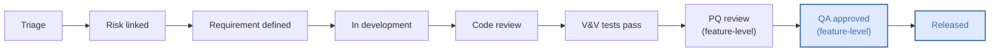
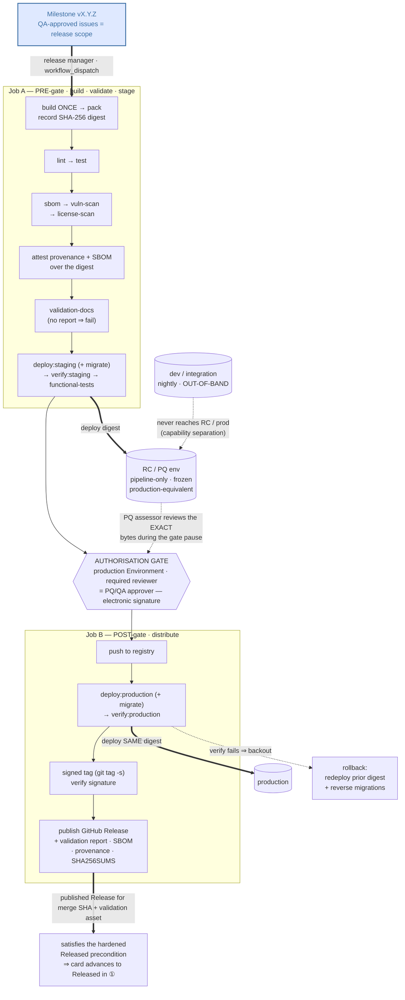

# GCP/MHRA Inspection-Resilient Release Process Implementation Plan

## Context

CCTC-team regulated repos already have the *development* half of a GxP-defensible
SDLC: org rulesets (signed commits, branch protection), `.compliance.yml` + schema,
the `gxp-traceability` PR gate, the `regulated_feature.yml` issue template, the
Project 30/31 "Regulated Feature Lifecycle" board, the `project-enforcement` /
`project-card-promote` / `project-audit` workflows, and getval validation-doc
generation in the FAKE build.

What is missing is the *release* half — but, critically, the *existing* release-adjacent
steps are also in the wrong order. The build (`~/repos/CCTC_Components/build/build.fs`)
today runs one linear FAKE chain that deploys to staging, runs functional tests, then
**packs, pushes the NuGet package to the registry, creates an *unsigned* annotated tag
(`git tag -a`), generates the validation report, and only then deploys to production**
(`build.fs:1044-1051`). Three things are wrong with that beyond the missing Release:
the package is **published to the registry and deployed to production before the
validation report that is supposed to authorise it even exists**; there is **no
authorisation gate** anywhere (whoever runs `fake` ships to prod); and the tag is
created mid-chain, unsigned, before production deploy has even succeeded. A git tag is
also a bare pointer; a Release is the durable, immutable, inspectable record that *this
exact version was validated and released*, with evidence attached. An MHRA inspector's
"show me what you released and the evidence it was validated" should be answered by one
Release page, not by SSH into a server.

So this plan is **not purely additive**: bolting provenance/SBOM/Release onto the current
chain would attest and "gate" an artifact that has already shipped — provenance theatre.
The plan therefore (a) adds a first-class release tier *and* (b) **inverts the existing
order so nothing is distributed before it is validated, scanned, and authorised**, with
the release artifact built **once** in a hardened runner and **that same artifact**
promoted to every environment, attested, and published. The best-practice set: a
build-once CI release pipeline, GitHub Release creation, milestone-scoped release notes +
traceability matrix, validation summary report attachment, SBOM, SLSA build-provenance
attestation over the released digest, checksums/signatures, dependency vulnerability
gating *before distribution*, an electronic-signature-grade production authorisation gate
that blocks distribution itself, a hardened "Released" board precondition, `release/*` +
tag ruleset confirmation, and the established evaluate→active rollout — all delivered as a
reusable workflow + thin caller, gated by `.compliance.yml`, exactly like the existing
compliance machinery. Achieving this requires **changes to each repo's existing build**
(the FAKE chain for CCTC_Components); those are called out explicitly throughout and
collected in the "Required build changes" section.

Nothing here is built yet; this is the plan only.

---

## Key References

- ⚠️ **`~/repos/CCTC_Components/build/` is ONE EXAMPLE implementation, not the
  contract.** Its FAKE target *names* (`Pack`, `Tag version in git`, `Build validation
  docs`), its tool choice (FAKE/F#), and its paths (`build/config/cctc_components_config.json`,
  `output/cctc_components.html`) are repo-specific. Other regulated repos may use MSBuild,
  Cake, npm scripts, or Make, with different names and layouts. **Do not hardcode any of
  these into the reusable workflow.** Read it to understand the *fundamental* process; the
  canonical tool-agnostic target set this plan defines is in Phase 0.
- `~/repos/CCTC_Components/build/build.fs:1044-1051` — the example target chain
  (`…→ Pack → Push → Tag version in git → Build validation docs → Deploy to Production`).
  Read it as a **cautionary** example: it packs, pushes to the registry, tags (unsigned), and
  deploys to production **before** validation runs and with **no** authorisation gate — the
  exact inversion this plan removes. The hand-off boundary is **not** a build-pushed tag (the
  original draft's assumption); it is the **once-built artifact (by digest)** produced by the
  CI pipeline, which then owns push/deploy/tag post-gate (Decisions 1, 6, 13). What the build
  must change is collected in "Required build changes".
- `~/repos/CCTC_Components/build/config/cctc_components_config.json` +
  `build.fs:986` — example getval invocation producing the validation report. The
  *requirement* is "a `validation-docs` target exists and emits a report to a declared
  path"; getval/this config is one way to satisfy it.
- `.github/workflows/gxp-traceability.yml` — the canonical pattern for a reusable,
  `.compliance.yml`-gated, evaluate/active workflow with Python heredocs that never
  interpolate untrusted data. The release workflow mirrors its security posture.
- `.github/workflows/project-card-promote.yml` + `scripts/project_enforcement/` — the
  Project-board state machine. The "Released" gate lives at
  `scripts/project_enforcement/checks/preconditions/released.py` and
  `scripts/project_enforcement/evidence.py:308` (`release_for_sha`).
- `templates/compliance/gxp-traceability-caller.yml` + `README-banner.md` +
  `.compliance.yml.example` — the thin-caller + drift-delivery + system_category-gating
  pattern every regulated repo opts into.
- `~/repos/claude-org/rules/essentials/regulated-gcp-checklist.md` — ALCOA+ and ICH
  E6(R3) §4.2/§4.3 obligations the release artifacts must satisfy (Attributable,
  Contemporaneous, Enduring, Available; validation status maintained; change control
  before release; dependency vuln scanning in CI).
- `AIPlans/Complete/Project board enforcement plan.md` — the phasing/style this plan
  follows, and the existing handler/evidence/checks structure to extend.

---

## Key Design Decisions

1. **The release is an authoritative *build-once* CI pipeline — not the local build, and
   not a thin wrapper bolted on after it.** A reusable `release.yml` runs on a hardened
   GitHub-hosted runner with OIDC identity, builds the distributable **exactly once**, and
   that **one artifact (identified by its digest)** is what gets scanned, validated,
   attested, deployed to staging, functionally tested, deployed to production, pushed to the
   registry, and published as the Release. **Build once, promote the same digest.** *Why:*
   SLSA provenance is only meaningful when the bytes attested are the bytes shipped. The
   original draft of this plan rebuilt "for provenance" *alongside* a local build that
   separately packed, pushed and deployed — so the attestation covered an artifact nobody
   consumed (the dev build's nupkg went to the registry; the CI rebuild, non-reproducible,
   was attested). That is provenance theatre. The only honest alternatives are build-once
   (chosen here) or fully reproducible builds (we do not assume them).
   - **Consequence for every repo's build:** the build tool is reduced to a set of
     *callable, idempotent* targets (Decision 11) that the pipeline invokes against a
     CI-provided version/artifact. **The build MUST NOT itself push to the registry, deploy
     to production, or create the release tag** — those move under the gated CI pipeline
     (Decisions 6, 13). A repo may keep a local convenience chain for dev/test environments,
     but it is **not** a release path. For CCTC_Components this means removing `Pack`/`Push`/
     `Tag version in git`/`Deploy to Production` from the end-to-end FAKE chain (see
     "Required build changes"). The workflow invokes each contractual target by reading a
     per-repo manifest, never by hardcoded command or path.
   - *Why not fold release into the local build tool:* a statement generated on a developer
     laptop proves nothing; the provenance guarantee requires the hardened runner. Keeping
     the build tool-agnostic (Decision 11/12) keeps the pipeline written once for all repos.

2. **Three orthogonal layers: Project board = lifecycle, Milestone = release scope,
   Release = publication.** A regulated issue carries a board *status* (Risk linked →
   … → Released) **and** a *milestone* (e.g. `v1.4.0`) — these are independent. One
   milestone = one release version = one defined requirement set. *Why:* "release 1.4.0
   validated REQ-024, REQ-031, REQ-040" is defensible; a stream of per-commit micro-tags
   is not. Milestone-batched releases are the GxP-friendly model.

3. **Release notes are milestone-scoped and custom-generated, not GitHub's default.**
   GitHub's `generate_release_notes` builds notes from PRs since the last tag; we instead
   query the **milestone's** closed issues/PRs and emit a categorised changelog *plus* a
   traceability appendix (issue → Risk ID → Requirement ID → `.feature` evidence → PQ/QA
   approver + signoff date). `.github/release.yml` still ships for label categorisation
   of the auto-section. *Why:* GxP needs requirement-set scoping and an inspector-facing
   traceability matrix, not a flat PR list.

4. **The validation summary report is regenerated *in the release workflow* by invoking
   the repo's `validation-docs` target, as the authoritative attached copy.** Rather than
   trusting whatever file a local build left behind, the release job runs the contractual
   `validation-docs` target (CCTC_Components happens to satisfy it with getval; another repo
   may use a different generator) against the released commit, over the once-built artifact,
   **before any distribution step (Decision 13)**, then attaches the report from the path the
   manifest declares. *Why:* single source of truth, attributable to the exact released SHA
   — ALCOA+ Attributable + Original — and tool-agnostic; and validation must precede release,
   not document it after the fact.

5. **Provenance and SBOM use GitHub Attestations (sigstore-backed), not self-managed
   cosign keys.** `actions/attest-build-provenance` + `actions/attest-sbom` mint keyless,
   OIDC-bound, transparency-logged attestations verifiable with `gh attestation verify`.
   *Why:* no signing-key custody burden, and the attestations are independently verifiable
   by an inspector or downstream consumer. SHA-256 checksums are still attached for
   air-gapped verification.

6. **A GitHub Environment with required reviewers gates *distribution itself* — and this
   *is* the electronic release authorisation.** The single CI job that performs the
   irreversible steps — push to the registry, `deploy:production`, publish the Release as
   `latest` — runs under a `production` Environment with required reviewers (the PQ/QA
   approver group). The approval is recorded **before** any of those steps run: logged,
   timestamped (UTC, contemporaneous), attributable, meaning "approved for release",
   enduring in the deployment log. **When the gate opens, the once-built artifact is already
   live on the qualified RC staging environment (Decision 14) and the validation report exists,
   so the PQ/QA reviewer performs their qualification review against that exact deployment
   before approving** — the automated `verify:staging`/`functional-tests` got the artifact *to*
   the gate; the human PQ review happens *at* it. *Why:* an authorisation that fires *after* the
   package is already on the registry and in production authorises nothing — which is exactly the
   current state, where the FAKE chain pushes and deploys with no approval at all. The gate
   must precede the irreversible steps. Reuses a platform primitive to satisfy ICH E6(R3)
   e-signature intent instead of building a bespoke flow. **This resolves the previously
   open question** (was: "should prod deploy move behind the gate or stay build-driven") —
   it moves behind the gate; the build no longer deploys to production at all (Decision 1).

7. **Dependency vulnerability scan gates the release.** The release job scans the generated
   SBOM (grype against the CycloneDX output) and fails on critical/high before a Release is
   published. *Why:* the GCP checklist requires "dependency vulnerability scanning in CI";
   a release is the right hard gate. Respects evaluate→active: warn-only until flipped.

8. **The "Released" board precondition is hardened to require a *published* Release.**
   Today `released.py` is satisfied by any release whose `target_commitish` matches the
   SHA *or even a bare tag pointing at it* (`evidence.py:308`). It will instead require a
   **published (non-draft)** Release referencing the merge SHA **with the validation-report
   asset attached**. *Why:* closes the gap where a tag alone — the thing the build already
   makes — falsely satisfies the strongest gate on the board.

9. **Delivery is reusable-workflow + thin-caller + compliance-drift, gated by
   `system_category`.** Identical to `gxp-traceability` and `project-card-promote`, so
   adoption across regulated repos is uniform and opt-in, and non-regulated repos are
   untouched. Rollout follows the same per-check evaluate→active log in the README.

10. **Long-term retention is documented, not assumed.** GitHub release assets are durable
    but not a 25-year archive of record. The release workflow's artifacts are *also* the
    inputs to the CTU QMS/archive export; this plan documents that hand-off as an
    operational follow-up rather than implementing an external archive sink. *Why:* the
    enduring/available obligation (ICH E6(R3) §4.2.7) is a records-management process the
    CTU owns; we make the artifacts exportable and say so explicitly rather than implying
    GitHub is the archive.

11. **The release contract is a defined set of *logical* build targets, tool-agnostic and
    owned by `claude-org`.** CCTC_Components' FAKE targets are one *implementation*; the
    contract names what every regulated repo's build MUST be able to do, not how. The
    canonical set (Phase 0) is `clean, restore, build, lint, test, docs, version, publish, pack,
    push, deploy:staging, verify:staging, functional-tests, tag, deploy:production,
    verify:production, migrate, rollback` for **all** software repos, plus `validation-docs` and
    `sbom` as **additionally mandatory for regulated** (`system_category != none`) repos. Each
    target has a defined responsibility and declared outputs. *Why:* the user's point exactly — the
    example must not be hardcoded. A contract lets MSBuild/Cake/npm/Make repos all comply,
    lets the release workflow be written once, and gives inspectors a uniform "every
    regulated system is built and released the same way" story. The spec lives in
    `claude-org` (guidance, the source of truth) and is enforceable from `.github`.

12. **The build↔workflow binding is a per-repo manifest, not convention.** Each repo
    declares, in `.github/release-targets.yml`, how to invoke each contractual target (the
    command) and where its outputs land (artifact globs, validation-report path, SBOM path),
    plus the version-pin env var the build honours. The reusable workflow computes the
    version, reads the manifest, runs the declared target commands in CI, and collects the
    declared outputs. *Why:* zero hardcoded paths/commands in the shared workflow
    (Decision 1); a repo changing its build tool only edits its manifest; the manifest is
    itself machine-checkable against the contract (Phase 0d).

13. **Gating *order* and *digest-pinning* are part of the contract — not left to each
    repo.** The contract (Phase 0) defines not only the target *set* but the mandatory
    *sequence*: `build → lint → test → sbom → vuln-scan → license-scan → attest →
    validation-docs → deploy:staging (+ migrate) → verify:staging → functional-tests →
    (e-signature gate) → push → deploy:production (+ migrate) → verify:production → tag →
    publish Release`, with a defined backout — `rollback` (redeploy the prior released digest;
    reverse migrations) — on any post-gate verification failure. Phase 3a Job A and the Process
    overview diagram ② show the gating-critical subset of this sequence in the **same relative
    order**; this decision and Phase 0 hold the full set, and the three must stay consistent. **No distribution step (`push`,
    `deploy:production`, tag creation, Release publish) may precede validation, scanning, or
    the authorisation gate.** The single built artifact's **digest is the promotion
    carrier**: `deploy:staging`, `deploy:production` and `push` all act on that one artifact,
    and the provenance attestation is over that digest. *Why:* the existing CCTC_Components
    order (`pack → push → tag → validation-docs → deploy:production`, `build.fs:1044-1051`)
    publishes and deploys *before* it validates and *with no* authorisation. Canonising the
    target set without the order would bless that inversion — the exact failure this plan
    exists to fix. The order is **not** repo-specific, so the reusable workflow encodes it as
    a fixed step sequence (the workflow *is* the order); the manifest only supplies the
    per-target commands. `contract.py` (Phase 0d) additionally flags any manifest that marks
    a distribution target as build-owned/standalone.

14. **There is exactly one qualified, pipeline-controlled "staging" environment, and it is the
    release-candidate (RC) / PQ environment — not a shared dev-integration target.**
    `deploy:staging` deploys the once-built artifact (by digest) to a *production-equivalent*
    environment that **only the release pipeline writes to**. The artifact stays frozen there
    from the end of Job A through the authorisation gate, so the PQ assessor reviews the **exact
    bytes that will ship**. Routine dev/CI deploys (e.g. nightly builds) are **out-of-band**:
    they target developers' own/ephemeral environments, are explicitly *not* a release path
    (Decision 1), and never touch the RC environment — so there is **no third always-on
    environment**, just dev (out-of-band) → RC staging (pipeline-only) → production. *Why:* PQ
    must run against a qualified, production-equivalent system showing the precise artifact under
    review (ALCOA+ Original + build-once, Decision 13); a box redeployed nightly is neither
    qualified nor stable enough to qualify against, and clobbering it mid-review would invalidate
    the PQ. This is the human counterpart to the *automated* `verify:staging` /
    `functional-tests`: those gate the artifact **to** the authorisation point; the human PQ/QA
    review happens **at** it (Decision 6), against the frozen RC deployment.

---

## Process overview

> **This is the TARGET end-state — the process once this plan is fully implemented**, not the
> current behaviour and not an intermediate step. It is the deliberate *inverse* of today's
> CCTC_Components chain (which packs, pushes, tags and deploys to production **before** it
> validates and **with no** authorisation gate — see "Context" and Decision 13), shown here as
> the goal every phase below builds toward. Nothing in these two diagrams exists yet; the phases
> are what deliver it.

The three layers (Decision 2) and the build-once RC→production pipeline (Decisions 1, 13, 14)
fit together as the two diagrams below — **① the Project 30 issue lifecycle** and **② the
release pipeline** that the milestone triggers. **Project 30** tracks each *issue's* lifecycle;
a *milestone* bundles the issues that make up one version; the *release pipeline* builds that
version **once** and promotes the single artifact (by digest) through the qualified RC/PQ
environment and the authorisation gate to production, publishing the Release that finally
satisfies the board's `Released` gate (the dashed return arrow from ② back into ①).

**① Project 30 — Regulated Feature Lifecycle (per issue, forward-only):**



`QA approved` issues that share a milestone feed the pipeline (②); `Released` is reached **only**
when ② publishes the qualifying Release. (`Redundant` / `Archived` are side-exits reachable from
any stage, omitted here for clarity.)

**② Release pipeline — build once, promote one digest (milestone → RC → production):**



Notes that the diagrams compress:

- **Board `PQ review`/`QA approved` are per-issue, feature-level sign-offs** reached during
  development (against the dev/integration environment). The pipeline's **authorisation gate** is
  the *release-level* performance qualification against the assembled milestone build on the
  qualified RC environment (Decision 14) — the human review of the exact bytes that will ship,
  recorded as the electronic signature (Decision 6). The two are related but distinct: a feature
  can be `QA approved` on the board long before its milestone is built and qualified for release.
- **One artifact, one digest** (Decisions 1, 13): the bytes deployed to RC, attested, pushed, and
  deployed to production are identical. Nightly dev builds never reach RC or production
  (capability separation, Decision 14).
- **The loop closes** when Job B publishes the Release: the hardened `released.py` precondition
  (Phase 5) sees a published Release for the merge SHA with the validation asset attached and
  only then allows each milestone card to advance to `Released`. In `evaluate` mode Job B is a
  dry-run (draft Release, no real push/prod deploy), so the gate and output are exercised before
  any version ships.
- **`verify:staging`/`verify:production` are liveness/smoke checks, not OQ.** Installation and
  operational qualification (IQ/OQ) of the RC and production environments are an environment-
  provisioning concern, tracked in "Open operational follow-ups" (RC/production provisioning),
  not depicted in diagram ②; PQ is the qualification step shown, performed by the assessor at
  the gate. The milestone + board lifecycle + authorisation gate together constitute the
  change-control record for the release.

---

## Phase 0: Define the canonical build-target contract (claude-org guidance + manifest)

The foundation. Until the contract exists, the release workflow has nothing tool-agnostic
to bind to. This phase produces the *specification* (in `claude-org`), the *binding schema*
(in `.github`), and a *checker* — no release behaviour yet.

- [ ] **0a. NEW (separate PR to the org repo):** `~/repos/claude-org/rules/guides/build-and-release.md`
  - The canonical, tool-agnostic build-target contract. For each logical target: its
    responsibility, its required outputs, and whether it is mandatory for **all** repos or
    **regulated-only**. Lead with a table:

    | Target | Responsibility | Required output | Scope |
    |---|---|---|---|
    | `clean` | Remove prior build outputs; re-run-safe | — | all |
    | `restore` | Restore pinned deps in locked/verified mode; fail on lockfile drift or hash mismatch | — | all |
    | `build` | Compile in Release config | compiled assemblies | all |
    | `lint` | Static analysis / linters / code-quality gate; fail on violation | analysis report | all |
    | `test` | Run automated tests; fail build on failure | test results | all |
    | `docs` | Generate API/user documentation | docs site | all |
    | `version` | Compute/stamp next version; pin-able via env | version string | all |
    | `publish` | Produce deployable artifact(s) | declared artifact path(s) | all |
    | `pack` | Package distributable (nupkg/container/zip) | declared package path(s) | all |
    | `push` | Publish package to the registry | — | all |
    | `deploy:staging` | Deploy to the qualified release-candidate (RC) / PQ environment | — | all |
    | `verify:staging` | Automated smoke/health checks on the RC environment | pass/fail | all |
    | `functional-tests` | E2E/functional suite (staging or deterministic sidecar) | results | all |
    | `tag` | Create a **signed**, annotated version tag on the release commit | `v{ver}` tag | all |
    | `deploy:production` | Deploy to production | — | all |
    | `verify:production` | Automated smoke/health checks on production | pass/fail | all |
    | `migrate` | Apply schema/data migrations for a deploy (forward); declare reversibility | migration log | all (stateful) |
    | `rollback` | Back out a failed release: redeploy the prior released digest + reverse migrations | — | all |
    | `validation-docs` | Generate validation summary report (URS→V&V→PQ→QA traceability) | declared report path | **regulated** |
    | `sbom` | Generate CycloneDX/SPDX SBOM | declared SBOM path | **regulated** |

  - **Cross-cutting properties (every target, stated once — not per row):** each target MUST be
    individually invocable, idempotent / re-run-safe, externally version-pinnable (honours
    `version_pin_env`), and **fail-closed** (a non-zero exit aborts the pipeline).
  - **Pipeline-native gates that are NOT build targets** (done by the workflow over a target's
    output, so they stay out of the manifest, like the existing vuln scan): `vuln-scan` and
    `license-scan` run over the `sbom` output; `attest` (SLSA provenance + SBOM), `checksums`
    (`SHA256SUMS`), and release-notes generation run over the recorded digest. List them in the
    canonical *sequence* (Decision 13) but not in the build-target table — they need no per-repo
    command.
  - State explicitly: the build *tool* is free (FAKE, MSBuild, Cake, npm, Make, …); the
    contract is the obligation, not the implementation. Show CCTC_Components' FAKE chain as
    **one worked example** mapping its target names to the canonical set — clearly labelled
    "example, not normative".
  - **Document the mandatory ordering and build-once/digest-promotion rules (Decision 13)**,
    not just the target set: the canonical sequence, that no distribution step may precede
    validation/scan/authorisation, and that one built artifact (by digest) is promoted to
    every environment. Show CCTC_Components' required *re-ordering* against its current chain.
  - **Document the environment model (Decision 14):** `deploy:staging`/`verify:staging` target
    the single *qualified, pipeline-controlled* release-candidate (RC) / PQ environment, not a
    shared dev-integration box; dev/CI deploys (nightly builds) are out-of-band and not a release
    path. State that the RC deployment is what the PQ assessor reviews during the authorisation
    gate and must stay frozen until the gate resolves.
  - Clarify ownership: the release *pipeline* invokes **all** release-path targets in CI
    (`build`/`pack`/`publish`/`validation-docs`/`sbom`/`deploy:*`/`verify:*`/`push`/`tag`) so
    one hardened build is attested and promoted; the build *tool* merely *provides* those
    targets as callable units. Distribution targets (`push`, `deploy:production`, `tag`) are
    pipeline-owned and post-gate — never run by a standalone local build chain.
  - Register it in `claude-org`'s rules index (the Tier-2 guides table in
    `rules/general.md`) and cross-link from `essentials/regulated-gcp-checklist.md`.

- [ ] **0b. NEW:** `.github/release-targets.schema.json`
  - JSON Schema (sibling to `compliance.schema.json`) for the per-repo manifest: a `targets`
    map keyed by the canonical target names, each with `run` (command string) and optional
    `outputs` (array of globs); a top-level `version_pin_env` (the env var the build honours
    to pin the version, e.g. CCTC_Components' `CCTC_PIN_VERSION`); informational `build_tool`.
    Mandatory-target presence is enforced by 0d, not the schema (it depends on
    `system_category`).

- [ ] **0c. NEW:** `templates/compliance/release-targets.yml.example`
  - A worked manifest **for CCTC_Components as the example**, every value commented as
    repo-specific and TODO-flagged, so a new repo owner adapts rather than copies. Drift
    stubs this into regulated repos as `.github/release-targets.yml` (wired in Phase 6).

- [ ] **0d. NEW:** `scripts/release/contract.py` (+ tests `tests/test_contract.py`, TDD)
  - Pure function: given a parsed manifest + the repo's `system_category`, return the list of
    missing mandatory targets and any declared target not in the canonical set. Used by the
    release workflow (fail fast) and by `compliance-check` (Phase 6) so a regulated repo that
    omits `validation-docs`/`sbom`, or never declares `tag`/`lint`/`rollback`, is flagged.
    **`migrate` is conditionally mandatory** — required only for stateful repos, declared by a
    manifest flag (e.g. `stateful: true`); the exact gating predicate is a refine-later detail,
    so for now treat `migrate` as required when the flag is set and optional otherwise. Tests
    cover: all mandatory present → ok; regulated repo missing `sbom` → flagged; repo missing
    `lint`/`rollback` → flagged; stateful repo missing `migrate` → flagged; stateless repo
    without `migrate` → ok; unknown target name → flagged; non-regulated repo without
    `validation-docs` → ok.

- [ ] **0e. MODIFY:** `compliance.schema.json`
  - Add an optional `release_targets_path` (default `.github/release-targets.yml`) so the
    manifest location is discoverable and overridable, consistent with how `validated_paths`
    etc. are declared.

---

## Phase 1: Milestone convention + release-notes config (docs, non-enforcing)

- [ ] **1a. NEW:** `docs/release-process.md`
  - The three-layer model (Decision 2) with a diagram: Project board status vs Milestone
    vs Release. Reuse/adapt the mermaid flowchart from the "Process overview" section above
    (board lifecycle → milestone → RC/production pipeline → published Release → `Released` gate).
  - The end-to-end flow: create milestone `vX.Y.Z` → assign regulated issues at triage →
    work through board columns → all milestone issues `QA approved` + merged → release manager
    triggers the pipeline (`workflow_dispatch`, milestone) → pipeline builds **once**, runs
    validation + SBOM + vuln scan + staging functional tests **(all pre-gate)** → production
    Environment approval (the e-signature) → pipeline pushes, deploys prod, creates the
    **signed** tag, and publishes the Release as `latest`. Emphasise the order: **validate and
    authorise before distribute**.
  - **The environment model and where PQ happens (Decision 14):** three roles, *not* three
    always-on servers — dev/integration (nightly builds, out-of-band, never a release path),
    one **qualified release-candidate (RC) / PQ environment** that only the release pipeline
    writes to, and production. Job A ends with the once-built artifact deployed to the RC
    environment and the validation report generated; the run then **pauses at the production
    Environment gate**. That pause is the PQ window: the **human PQ/QA assessor reviews the RC
    deployment** (the exact bytes that will ship) plus the attached validation report and
    traceability matrix, then records approval — which unblocks Job B. State plainly that the
    automated `verify:staging`/`functional-tests` are preconditions that get the artifact *to*
    the gate, not PQ itself; that the RC environment must stay **frozen** for the review window;
    and that nightly dev builds must never deploy to it.
  - The artifact set attached to every regulated Release and the ICH E6(R3)/ALCOA+ clause
    each one answers (validation report, traceability matrix, SBOM, provenance, checksums,
    authorisation record). Inspector-facing "where is X" table.
  - The milestone naming/versioning convention (SemVer `vMAJOR.MINOR.PATCH`, one milestone
    per release, milestone closed on publish).

- [ ] **1b. NEW:** `templates/compliance/release.yml`
  - Ships into regulated repos as `.github/release.yml` (auto-generated notes
    categorisation). Categories keyed off existing labels: `regulated`/`validation` →
    "Validated requirements", `bug` → "Fixes", `security` → "Security", catch-all →
    "Other". `exclude` the bot/automation labels.
  - Header comment noting the custom milestone-scoped generator (Phase 2) produces the
    authoritative notes; this config only shapes the auto-section.

- [ ] **1c. MODIFY:** `templates/compliance/CONTRIBUTING-regulated.md`
  - Add a "Releases & milestones" section: assign your issue to the target milestone;
    what a Release means; that a release cannot publish without a green validation report.

- [ ] **1d. MODIFY:** `README.md`
  - New "## Release process" section summarising the three layers, linking
    `docs/release-process.md`, and adding a row set to the rollout log table for the
    release workflow + hardened Released gate (filled in Phase 8).

---

## Phase 2: Milestone-scoped release-notes + traceability generator (TDD)

Pure-Python unit, highest design value — write tests first (paired sub-items).

- [ ] **2a. NEW (Tests):** `scripts/release/tests/test_notes.py`
  - Given a fixture set of milestone issues/PRs (closed, with `Risk ID:` /
    `Requirement ID:` / `Feature link:` bodies, labels, PQ/QA approver fields), assert:
    categorised changelog grouped by label; a traceability table with one row per
    requirement (issue # → Risk ID → Requirement ID → `.feature` URL(s) → PQ approver/date
    → QA approver/date); missing-field rows flagged `_missing_`; non-regulated issues
    listed but not in the traceability matrix; deterministic ordering.
  - Reuse the body-parsing regexes proven in `gxp-traceability.yml`
    (`^[#\s>*-]*risk\s*id\s*:`) so behaviour matches the PR gate.

- [ ] **2b. NEW (Implementation):** `scripts/release/__init__.py`, `scripts/release/notes.py`
  - `build_notes(repo, milestone, tag, prev_tag, evidence) -> str`. Queries milestone
    issues/PRs via `gh api`/GraphQL, parses bodies, emits markdown: summary line, auto
    changelog (label categories), then `## Traceability matrix` table, then a
    `## Release authorisation` placeholder block filled by the workflow (approver identities
    from the environment approval).
  - Follow the security posture of `gxp-traceability.yml`: untrusted issue bodies are read
    from files / passed as data, never interpolated into shell or Python source.

- [ ] **2c. NEW:** `scripts/release/sbom_scan.py`
  - Thin wrapper: parse grype JSON, return non-zero count of critical/high, format a
    markdown summary for the step summary. Pure function over the scanner's JSON so it is
    unit-testable; the scanner invocation itself lives in the workflow.

- [ ] **2d. NEW (Tests):** `scripts/release/tests/test_sbom_scan.py`
  - Fixtures for clean / high / critical grype output; assert counts + summary text.

---

## Phase 3: Reusable release workflow

- [ ] **3a. NEW:** `.github/workflows/release.yml` (reusable, `on: workflow_call`)
  - **Trigger / hand-off boundary (changed from the original draft):** because the build no
    longer creates the release tag or self-distributes (Decision 1), the pipeline is **not**
    triggered by a build-pushed `v*` tag. The caller (3b) triggers it on `workflow_dispatch`
    (release manager picks the milestone) and/or a push to `release/*`. The pipeline **creates
    the signed tag itself, post-gate** (Job B). *Why:* build-once requires the pipeline to be
    the builder; a tag pushed by a local build that already packed/pushed/deployed is exactly
    the inverted flow being removed.
  - **Inputs:** `compliance_path` (default `.compliance.yml`), `ref` (commit/branch to
    release, default the default branch), `milestone` (required — the release scope),
    `version` (optional; else computed by the `version` target), `enforcement`
    (`evaluate`|`active`, default `evaluate` — controls vuln gate + publish-vs-draft + whether
    distribution actually runs), `environment` (default `production`, Phase 4).
    **No build-tool, path, or command inputs** — those come from the manifest (Decision 12),
    so the workflow is identical across repos regardless of build tool.
  - **Permissions:** `contents: write`, `id-token: write`, `attestations: write`,
    `packages: write` (the pipeline now pushes), `issues: read`, `pull-requests: read`.
  - **Gate + contract-check first** (mirror `gxp-traceability.yml` steps 1–2): if no
    `.compliance.yml` or `system_category == none`, exit success. Otherwise load
    `.github/release-targets.yml` (path from `release_targets_path`) and run
    `scripts/release/contract.py` — **fail fast** if a mandatory target is missing/undeclared
    **or a distribution target is marked `owner: build`** (the self-distribution check). This
    is where a repo whose build doesn't meet the contract is caught.
  - **Two jobs split by the authorisation gate.** Job A (`build-validate`) runs everything up
    to and including staging validation; Job B (`distribute`) runs under
    `environment: ${{ inputs.environment }}` so the required-reviewer approval is recorded
    **before** any distribution. Every build action is `manifest.targets.<name>.run`, never a
    hardcoded command; every artifact is collected from `manifest.targets.<name>.outputs`.
  - **Job A — build, validate, scan, stage (pre-gate):**
    1. `actions/checkout@v6` at `ref`, `fetch-depth: 0`. Compute `version` (the `version`
       target, or the input) and export it via the manifest's `version_pin_env` so every
       downstream target stamps the **one** released version.
    2. Run `build` **once**, then `lint` and `test` (both fail-closed), then `pack`/`publish`
       (which repackage the once-built output — the contract forbids a recompile). Collect the
       deployable artifact(s) from declared `outputs`; **record each artifact's SHA-256 digest**
       as the promotion identity.
       *This single build is what is deployed, pushed, and attested (Decisions 1, 13).*
    3. Run `sbom` over the built artifact (or fall back to a generic CycloneDX step) →
       collect from declared `outputs`.
    4. Vulnerability scan the SBOM (grype) → `scripts/release/sbom_scan.py`; `active` =
       **fail before any distribution** on critical/high, `evaluate` = `::warning::` +
       continue. Run `license-scan` over the same SBOM (disallowed-licence policy), same
       evaluate/active semantics.
    5. `actions/attest-build-provenance` + `actions/attest-sbom` **over the recorded digest**
       — the attestation now covers the exact artifact that will ship.
    6. Run `validation-docs` over the released commit/built artifact; collect the report.
       **Fail if the target fails or the report is empty** — no validation evidence, no
       release. (CCTC_Components satisfies this with getval; the workflow neither knows nor
       cares.) Note this runs **before** any distribution (the inversion fix).
    7. `deploy:staging` of the recorded artifact (applying `migrate` forward as part of the
       deploy) → `verify:staging` → `functional-tests`. A failure here stops the release before
       the gate. (Targets the build *provides*; the pipeline *invokes* them — they no longer
       live in a standalone build chain.)
    8. Upload artifact(s) + digest + SBOM + validation report + notes inputs to the job's
       artifact store for Job B (so Job B distributes the *same* bytes, never a rebuild).
  - **Job B — authorise, then distribute (post-gate, `environment: production`):**
    9. The job pauses on the Environment's required reviewers. Their approval is the
       electronic release authorisation (Decision 6) — captured: who, UTC timestamp,
       meaning "approved for release".
    10. `push` the recorded package to the registry; `deploy:production` of the **same
        digest** (applying `migrate` forward); `verify:production`. On `verify:production` (or
        any post-gate) failure, invoke `rollback` — redeploy the prior released digest and
        reverse migrations — before failing the run.
    11. Create the **signed** tag (`git tag -s v{version}`) on the released commit and push
        it; **verify the signature** before continuing (refuse to publish an unsigned tag).
    12. SHA-256 checksums over every asset → `SHA256SUMS`; build notes via
        `scripts/release/notes.py` (milestone-scoped + traceability matrix) with the
        `## Release authorisation` block filled from the approval record.
    13. Create the GitHub Release for the tag via `gh release create`, **draft in `evaluate`
        mode, published + `latest` in `active` mode**, attaching deployable(s), validation
        report, SBOM, `SHA256SUMS`, and notes. Mark prerelease for a `-rc`/`-beta` suffix.
  - Write a `$GITHUB_STEP_SUMMARY` table of every attached artifact + checksum + attestation
    status + the approving reviewer/timestamp (the inspector-facing manifest).

- [ ] **3b. NEW:** `templates/compliance/release-caller.yml`
  - Thin caller shipped as `.github/workflows/release.yml` in the regulated repo:
    ```yaml
    name: Release
    on:
      workflow_dispatch:
        inputs:
          milestone:
            description: 'Milestone / release scope (e.g. v1.4.0)'
            required: true
      # optional: also trigger on a protected release branch
      # push:
      #   branches: ['release/*']
    jobs:
      release:
        permissions:
          contents: write
          id-token: write
          attestations: write
          packages: write
          issues: read
          pull-requests: read
        uses: CCTC-team/.github/.github/workflows/release.yml@main
        with:
          milestone: ${{ inputs.milestone }}
          enforcement: evaluate   # flip to active after one clean cycle
          environment: production
    ```
  - The caller carries **no repo-specific paths** — all binding is in
    `.github/release-targets.yml` (Phase 0c). Header comment explains: the evaluate→active
    flip; that in `evaluate` mode Job B still runs but cuts a **draft** Release and skips the
    real registry push / prod deploy (dry-run) so the team inspects output before any version
    ships; and points at the manifest for build-tool/path configuration.

---

## Phase 4: Signed tags + production authorisation environment (docs + config)

Mostly GitHub configuration + documentation; no app code. Exception to TDD (configuration
and process, not verifiable logic).

- [ ] **4a. Contract requirement: the `tag` target produces a SIGNED tag, and the pipeline
  (not the build) creates it post-gate.** Part of the canonical contract (Phase 0a): the tag
  is `git tag -s`, not `-a`, so the released version carries the same cryptographic
  attribution the commit ruleset already requires; and it is created by the pipeline's Job B
  after the authorisation gate (Decision 13), never by the local build mid-chain. The
  pipeline verifies the signature before publishing.
  - *Required build change (see "Required build changes"):* CCTC_Components' `Tag version in
    git` (`build.fs:979`) currently uses `git tag -a` **and runs inside the FAKE chain before
    validation and prod deploy**. It must be removed from that chain; if retained at all it
    becomes a callable `tag` target the pipeline invokes (signed). The signing key is
    provisioned on the **GitHub-hosted pipeline runner**, not a developer/build box.

- [ ] **4b. NEW:** `docs/release-authorisation.md`
  - How to configure the `production` GitHub **Environment** with required reviewers (the
    PQ/QA approver group), and how that approval is the electronic release authorisation
    (Decision 6): who approved, when (UTC, contemporaneous), meaning ("approved for
    release"), enduring in the deployment log.
  - Make explicit that the Environment gates **Job B (distribute)** — the registry push,
    `deploy:production`, signed tag, and Release publish — so the approval **precedes all
    irreversible steps**. Contrast with the current FAKE chain, which deploys to production
    with no approval at all.
  - State that the approver performs their **PQ qualification review against the frozen RC
    staging deployment (Decision 14)** during the gate pause — the artifact is already live and
    is the exact build that will ship — before recording approval. Note the operational
    requirement that the RC environment stay frozen (no nightly/dev redeploys) for the duration
    of the review, and that GitHub holds the paused run on the required reviewers for up to 30
    days, bounding the review window.
  - Maps each property to ICH E6(R3) e-signature expectations from the regulated-gcp
    checklist.

- [ ] **4c. MODIFY:** `.github/workflows/release.yml`
  - Wire Job B with `environment: ${{ inputs.environment }}` (default `production`) so it
    blocks on the required reviewers before any distribution. The release notes'
    `## Release authorisation` block is filled with the approver identity + UTC timestamp
    from the deployment record. In `evaluate` mode Job B runs as a dry-run (draft Release, no
    real push/prod deploy) so the gate and output can be exercised before going live.

---

## Phase 5: Harden the "Released" board precondition (TDD)

- [ ] **5a. NEW (Tests):** extend `scripts/project_enforcement/tests/test_evidence.py`
  - For a new `published_release_for_sha`: a draft release matching the SHA → not
    satisfied; a published release matching the SHA but **without** the validation asset →
    not satisfied; a published release with the asset → satisfied (returns release meta);
    a bare tag pointing at the SHA → not satisfied (this is the regression the old method
    allowed).

- [ ] **5b. MODIFY:** `scripts/project_enforcement/evidence.py`
  - Add `published_release_for_sha(self, repo, sha) -> Optional[ReleaseMeta]` to the
    protocol (`:114`), `GhEvidence` (`:308`), and the fake (`:357`). Real impl: page
    `/repos/{repo}/releases`, require `draft == false`, resolve the release tag to the SHA
    (not just `target_commitish` string match — resolve via the tag ref), and inspect
    `assets[].name` for the validation-report pattern (e.g. `*validation*.html` / a
    configured name). Keep the old `release_for_sha` or replace its only caller.

- [ ] **5c. MODIFY:** `scripts/project_enforcement/checks/preconditions/released.py`
  - Replace the `release_for_sha` call with `published_release_for_sha`. Emit precise
    reasons: "no published Release references merge SHA", or "Release `vX.Y.Z` references
    the SHA but has no validation report attached — the release workflow must run in active
    mode and succeed." Optionally also require a provenance attestation (behind a config
    flag, default off until the workflow is active everywhere).

- [ ] **5d. MODIFY:** `scripts/project_enforcement/checks/preconditions/__init__.py` /
  handler wiring if the new evidence method needs registering. Run the existing
  `test_handler_smoke.py` to confirm no signature drift.

---

## Phase 6: Ship via compliance-drift + ruleset confirmation

- [ ] **6a. MODIFY:** the compliance-drift stubbing (`scripts/` drift code +
  `.github/workflows/compliance-drift.yml`)
  - Add to the set drift stubs into regulated repos (same mechanism as the gxp-traceability
    caller; idempotent; only when absent):
    `templates/compliance/release.yml` → `.github/release.yml`,
    `templates/compliance/release-caller.yml` → `.github/workflows/release.yml`, and
    `templates/compliance/release-targets.yml.example` → `.github/release-targets.yml`
    (TODO-flagged so the owner fills in their build-tool commands/paths).

- [ ] **6b. MODIFY:** `.github/workflows/compliance-check.yml` (contract enforcement)
  - For regulated repos, load `.github/release-targets.yml` and run
    `scripts/release/contract.py` (Phase 0d): a regulated repo missing a mandatory target
    (no `tag`, no `validation-docs`, no `sbom`, …) is flagged. evaluate→active like the
    other checks. *Why here:* this is what makes "the contract" real — a repo can't quietly
    ship without meeting the defined target set; it's caught on every PR, not only at release.

- [ ] **6c. MODIFY:** `rulesets/cctc-critical-trial.json` (confirm, amend only if needed)
  - Verify `refs/heads/release/*` (`:11`) inherits the same `pull_request` review +
    `required_signatures` + `non_fast_forward`/`deletion` rules as `main`. If the rules
    array doesn't already apply to the release branch include, document the gap; do not
    silently widen scope.
  - Add (or document adding) a **tag ruleset** protecting `refs/tags/v*` against deletion
    and non-fast-forward so a published version tag is immutable — the inspection-resilience
    payoff (a release tag can never be moved or re-pointed).

- [ ] **6d. MODIFY:** `docs/release-process.md`
  - Cross-link the ruleset guarantees (immutable tags, protected release branches) and the
    drift-delivered files so a new regulated repo's owner knows what arrives automatically
    (`release.yml`, the caller, the manifest stub) vs what they must do themselves (fill in
    `.github/release-targets.yml` for their build tool, configure the `production`
    environment).

---

## Phase 7: Evaluate → active rollout

- [ ] **7a. MODIFY:** `.github/project-enforcement.yml`
  - Leave `preconditions: Released: evaluate` until the release workflow has cut at least
    one real published Release with all artifacts green (the existing README note already
    couples Released to the release machinery). Document the dependency inline.

- [ ] **7b. MODIFY:** `README.md` rollout log table (`:582`)
  - Add rows: `release workflow (publish)`, `release workflow (vuln gate)`,
    `preconditions: Released (hardened)` — all `_pending_`, with the "flip after one clean
    evaluate cycle" note. The release caller ships with `enforcement: evaluate` (draft
    releases, warn-only vuln gate); flip to `active` per repo after a clean cycle and record
    the date here.

- [ ] **7c. MODIFY:** `docs/release-process.md`
  - Final "rollout" subsection: evaluate mode cuts a **draft** Release with all artifacts so
    the team can inspect the full output before any version is published; active mode
    publishes and enforces the vuln gate + the production-environment approval.

---

## Required build changes (per-repo; CCTC_Components FAKE as the worked example)

This plan is **not purely additive**. Each regulated repo's build must change so the release
pipeline (not the build) owns distribution and the build-once/order rules hold. The `.github`
repo only *documents and enforces* these; each product repo lands them as its own PR. Listed
against CCTC_Components' `build.fs` as the concrete example — the same shape applies to any
build tool.

- [ ] **Remove distribution from the end-to-end FAKE chain.** Drop `Pack` /
  `Push CCTC_Components package` / `Tag version in git` / `Deploy to Production` (and the prod
  Cloudflare-purge + `Verify production boot`) from the linear `==>` chain
  (`build.fs:1044-1051`). These become **pipeline-owned, post-gate** steps. The standalone
  FAKE chain may still build/test/deploy-to-a-*dev*-environment/functional-test for dev use, but
  it is **not a release path** and must not reach the RC/PQ environment, production, or the
  registry (next bullet).
- [ ] **The dev chain must not deploy to the RC/PQ environment; enforce by capability, not
  policy (Decision 14).** Any dev-convenience `deploy:staging` in the standalone chain targets a
  *dev/integration* environment, never the qualified RC environment the PQ assessor reviews. The
  enforcement is **separation by credential**: the RC (and production) deploy secrets/targets
  exist **only on the GitHub-hosted pipeline runner** (scoped to the release Environments), so a
  developer or nightly build *cannot* reach the RC environment even by mistake — there is no
  manual "remember to freeze it" step to fail. For CCTC_Components: `deployVersionedBuild`'s
  RC/production endpoints and their credentials move to the pipeline runner; the local chain
  keeps only a dev-environment target (or none).
- [ ] **Fix the order so nothing distributes before validation.** Today `Build validation
  docs` (`build.fs:986`) runs *after* `Push` and `Tag`. Under the contract, `validation-docs`
  (and `sbom`, vuln scan) run **before** any push/deploy/tag — enforced by the pipeline's
  fixed step order, but the build's targets must be individually invocable so the pipeline can
  sequence them.
- [ ] **Make targets callable + idempotent + externally version-pinnable.** Each canonical
  target must be invocable on its own (FAKE already supports `-t <target>`), re-run-safe, and
  honour an **external version pin** via env (`version_pin_env`, e.g. `CCTC_PIN_VERSION`).
  Today the version comes from a `--nextVer` arg computed mid-chain (`build.fs:938,958,979`);
  it must instead accept the pipeline-supplied version so build/pack/push/deploy all stamp the
  **one** released version.
- [ ] **Build once; pack/push/deploy consume that artifact.** `Pack` already uses
  `NoBuild = true` (`build.fs:938`) — good; keep that contract (no recompile in `pack`).
  `deployVersionedBuild` (staging *and* production) and `Push` must deploy/push the artifact
  the pipeline built and recorded by digest, not rebuild.
- [ ] **Expose a `lint` / static-analysis target.** Provide a callable, fail-closed `lint`
  (e.g. `dotnet format --verify-no-changes` + the project's analyzers/linters); today the FAKE
  chain has no standalone static-analysis gate distinct from `test`.
- [ ] **Expose `migrate` for the datastores, with declared reversibility.** CCTC_Components is
  stateful (SQL Server via EF Core, Neo4j). Provide a callable `migrate` that applies forward
  schema/data migrations as part of `deploy:*` and declares how each is reversed; mark the repo
  `stateful: true` in the manifest so `contract.py` requires `migrate`. The pipeline runs it
  inside the deploy and pairs it with `rollback`. *(Exact migration/rollback strategy per
  datastore is a refine-later detail.)*
- [ ] **Expose `rollback` (backout).** Provide a callable `rollback` that redeploys the prior
  released digest (immutable, attested) and reverses migrations; the pipeline invokes it on any
  post-gate verification failure. Today there is **no** backout path — a failed prod deploy
  leaves a partially-distributed release.
- [ ] **Sign the tag, on the pipeline runner.** `git tag -a` → `git tag -s`
  (`build.fs:979`); provision the signing key on the **GitHub-hosted pipeline runner** (the
  pipeline creates the tag post-gate), not a developer/build box.
- [ ] **Acknowledge smoke-vs-functional.** `Pause 30 seconds` + `Verify * boot`
  (`build.fs:650,683,701`) are liveness smoke checks, not release gates; the functional suite
  and the e-signature gate are the controls. No code change required — documented so the crude
  pause isn't mistaken for verification.
- [ ] **Author the manifest.** Map every FAKE target to the canonical set in
  `.github/release-targets.yml` (from the Phase 0c example), `version_pin_env: CCTC_PIN_VERSION`,
  `stateful: true`, marking `push`/`deploy:production`/`tag`/`migrate`/`rollback` as
  `owner: pipeline`.

---

## Verification

- [ ] The build-target contract guide exists in `claude-org`, is registered in the rules
  index, and lists every canonical target with scope (all vs regulated) **and the mandatory
  ordering + build-once/digest-promotion rules**. The CCTC_Components mapping is labelled
  "example, not normative" and shows the required re-ordering.
- [ ] `contract.py` correctly accepts a complete manifest and flags a regulated manifest
  missing `validation-docs`/`sbom`/`tag`/`lint`/`rollback`, a `stateful: true` manifest missing
  `migrate`, any unknown target name, a missing `version_pin_env`, and any distribution target
  (`push`/`deploy:production`/`tag`) marked `owner: build` (the self-distribution regression).
- [ ] **Backout proof:** a run seeded with a failing `verify:production` (post-gate) invokes
  `rollback` — the prior released digest is redeployed and migrations reversed — and the run
  ends failed without leaving the new version live or published.
- [ ] **Tool-agnostic proof:** the reusable `release.yml` contains no repo-specific path,
  filename, or build command (no `getval`, no `build/config/...`, no `*.nupkg` literal) —
  every build action reads from `.github/release-targets.yml`. Grep confirms this.
- [ ] A second, deliberately *different* manifest (e.g. an MSBuild/`dotnet`-only invocation
  with no FAKE) drives the same workflow to a successful dry-run release — proving the
  contract, not the example, is what the workflow binds to.
- [ ] All workflow YAML lints clean (`actionlint`); the reusable `release.yml` parses and
  its `workflow_call` inputs resolve from `release-caller.yml`.
- [ ] `scripts/release/` and `scripts/project_enforcement/` unit tests pass
  (`python -m pytest`), including the contract checker, notes-generator, sbom-scan, and
  `published_release_for_sha` regression tests.
- [ ] End-to-end dry run on the **test** project/repo (Project 31): `workflow_dispatch` with
  a test milestone → release workflow in `evaluate` builds once, runs validation+SBOM+scan
  pre-gate, and cuts a **draft** Release with notes + traceability matrix + validation report
  + SBOM + provenance attestation + `SHA256SUMS` attached, **without** a real registry push or
  prod deploy; step-summary manifest is complete.
- [ ] **Build-once / digest proof:** the artifact deployed to staging, the artifact pushed to
  the registry, the artifact deployed to production, and the artifact the attestation covers
  all carry the **same SHA-256 digest** — confirming a single build is promoted, not rebuilt
  per step.
- [ ] **Order proof:** in a run seeded with a failing validation report (or a critical vuln in
  `active`), the pipeline fails **before** any push/deploy/tag — no artifact reaches the
  registry or production.
- [ ] **RC isolation proof (Decision 14):** the standalone dev/build chain has no credentials or
  target for the RC/PQ environment — a dev-run `deploy` cannot reach it (capability separation),
  and only the pipeline (via the release Environment) can deploy the RC the assessor reviews.
- [ ] `gh attestation verify` succeeds against the produced artifact + SBOM, and the verified
  artifact digest matches the one distributed.
- [ ] Hardened `released` gate: a card whose issue's PR merged and a **bare tag** exists is
  **not** advanced to Released (regression); the same card after a published Release with
  the validation asset **is** allowed.
- [ ] Vulnerability gate: a seeded critical advisory fails the release in `active` mode and
  only warns in `evaluate`.
- [ ] Production-environment approval blocks **Job B (registry push, prod deploy, tag,
  publish)** until a required reviewer approves — i.e. the approval precedes all distribution,
  not just the `latest` flag — and the approver + UTC timestamp land in the Release's
  authorisation block.
- [ ] `compliance-drift` dry run shows `.github/release.yml` + the release caller being
  stubbed into a regulated repo and nothing into a `system_category: none` repo.
- [ ] Tag ruleset confirmed: a published `v*` tag cannot be deleted or moved.
- [ ] Signed-tag check: the release workflow verifies the `v*` tag is GPG/SSH-signed and
  refuses to publish an unsigned tag.

---

## Open operational follow-ups (not in scope, tracked separately)

- 25-year **enduring/available** archive: export released artifacts (validation report,
  SBOM, provenance) to the CTU QMS/long-term archive of record. GitHub is the working
  store, not the archive (Decision 10).
- Signed-tag key custody on the **pipeline runner** (Phase 4a) — provisioning the signing
  key for the GitHub-hosted runner that now creates the tag; raise per-repo.
- **RC/production environment provisioning (Decision 14):** stand up a qualified, production-
  equivalent RC/PQ environment and scope its deploy credentials (and production's) to the
  release Environments on the pipeline runner only — so capability separation, not policy,
  keeps dev/nightly builds out. Per-repo infra task; includes confirming the dev chain's
  staging target points elsewhere (or is removed).
- Per-repo migration effort to land the "Required build changes" (removing distribution from
  the FAKE chain, making targets pin-able/idempotent) — tracked as a build PR in each product
  repo, sequenced after the contract + workflow exist here.
- *(Resolved, no longer open)* Whether the production deploy moves behind the Environment gate
  — it does (Decision 6); the build no longer deploys to production.
